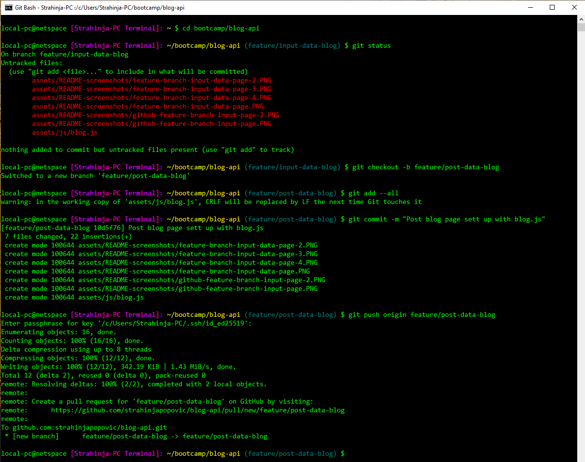

# Blog-API

## Description

Blog-API is a basic Client-side JavaScript web API and online blog-post presentation system. It is developed mostly by combining `HTML` and `CSS` for rendering with support of `JavaScript` and `jQuery` functional capabilities.

## Usage

New repository created at GitHub account strahinjapopovic as blog-api.

*Continuing with Git Bash directory tree sett up...*

Project has been pushed from the local storage to GitHub with codebase and new **branch** was created as **(feature/input-data-blog)**.

Marge the ***(main)*** branch with ***(feature/input-data-blog)*** feature branch as follows.

Marge the ***(main)*** branch with ***(feature/post-data-blog)*** feature branch as follows.

### *All Branches*

### *Application has been deployed on a live server with a following results:*

*Page number 1 with input fields...*

*Page number 2 with post(s)...*

*Error message for empty field(s)...*

*Different style applied with toggle button...*

Repository over GitHub account you can find [GitHub Repos][1] and application deployment at [GitHub Pages][2].

[1]: https://github.com/strahinjapopovic/blog-api/           "GitHub Repos"
[2]: https://strahinjapopovic.github.io/blog-api/            "GitHub Pages"

## License

Please refer to the MIT LICENSE in the repo.
